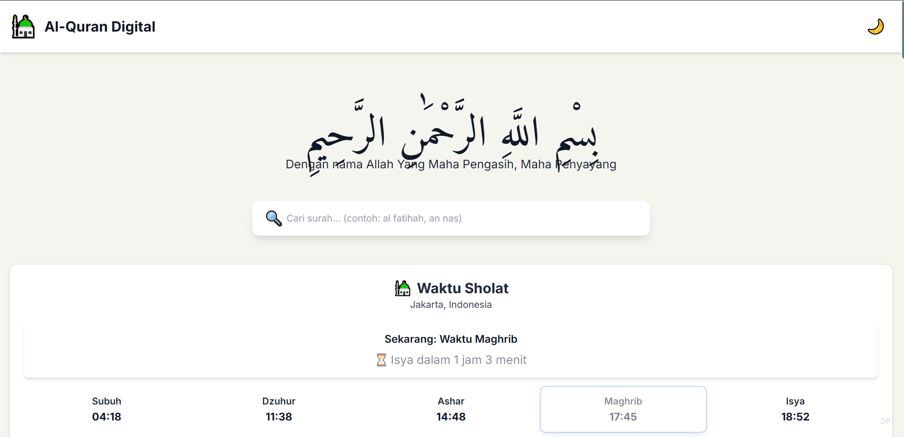
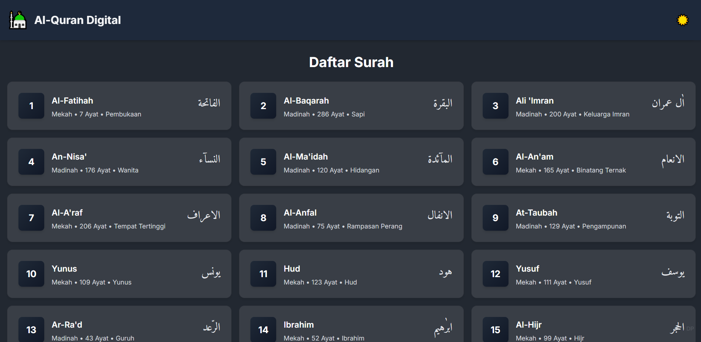
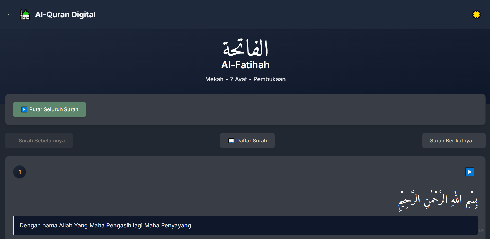

# Al-Quran Digital

Aplikasi web Al-Quran digital modern dengan terjemahan Bahasa Indonesia, audio per ayat dengan mode continuous play, dan jadwal sholat realtime.

## 📸 Screenshots


*Homepage dengan daftar surah - Light Mode*


*Homepage dengan daftar surah - Dark Mode*


*Detail surah dengan audio player dan ayat*

## 🌟 Fitur Utama

### Core Features
- **114 Surah Al-Quran** dengan terjemahan Bahasa Indonesia lengkap
- **Audio Player** untuk setiap ayat (Abdul Basit Murattal 192kbps)
- **Continuous Audio Playback** - Auto-play seluruh surah dari ayat ke ayat
- **Jadwal Sholat Realtime** berdasarkan lokasi dengan countdown timer
- **Search & Autocomplete** - Cari surah dengan saran otomatis
- **Dark/Light Mode** dengan smooth transitions dan adaptive text colors
- **Responsive Design** - Mobile-first approach untuk semua perangkat

### UI/UX Features
- **Varied Animations** - 3 jenis animasi card yang berbeda (fadeInUp, fadeIn, scaleIn)
- **Interactive Hover Effects** - Alternating lift & bounce effects
- **Adaptive Color Contrast** - Font colors yang otomatis menyesuaikan dengan tema
- **Cream/Beige/Sage Green** palette untuk light mode
- **Navy/Grey** palette untuk dark mode
- **Smooth Transitions** di semua komponen
- **Staggered Card Animations** untuk pengalaman visual yang menarik

### Audio Features
- **Continuous Play Mode** - Putar seluruh surah secara berurutan
- Play/Pause/Stop controls yang responsif
- Audio otomatis berhenti saat navigasi ke halaman lain
- Visual feedback saat audio sedang diputar (highlight & pulse animation)
- Auto-play ke ayat berikutnya

### Prayer Times Features
- Kalkulasi otomatis berdasarkan geolokasi
- Geolocation support dengan fallback Jakarta
- Highlight waktu sholat aktif dengan countdown
- Update otomatis setiap menit
- Adaptive text colors untuk dark/light mode

## 🛠️ Teknologi

### Frontend Stack
- **Vue 3** - Progressive JavaScript Framework (Composition API)
- **TypeScript** - Type-safe JavaScript
- **Vite** - Next Generation Frontend Tooling
- **Pinia** - State Management for Vue
- **Vue Router** - Official Router for Vue.js
- **TailwindCSS** - Utility-first CSS framework

### Libraries & APIs
- **Adhan.js** - Kalkulasi waktu sholat akurat
- **EveryAyah.com API** - Audio Al-Quran per ayat (Abdul Basit)
- **Equran.id API** - Data Al-Quran dengan terjemahan Indonesia
- **Google Fonts** - Amiri Quran (Arab), Inter (Latin)

## 📁 Struktur Proyek

```
quran/
├── public/               # Static assets
├── src/
│   ├── assets/          # Images, fonts, icons
│   ├── components/      # Vue components (if any)
│   ├── router/          # Vue Router configuration
│   │   └── index.ts
│   ├── stores/          # Pinia stores
│   │   ├── quran.ts     # Quran data management
│   │   ├── prayer.ts    # Prayer times management
│   │   └── theme.ts     # Dark/light mode
│   ├── views/           # Page components
│   │   ├── HomeView.vue # Homepage dengan daftar surah
│   │   └── SurahView.vue # Detail surah & ayat
│   ├── App.vue          # Root component
│   ├── main.ts          # Application entry point
│   └── style.css        # Global styles & animations
├── index.html
├── package.json
├── tsconfig.json
├── vite.config.ts
├── tailwind.config.js
└── README.md
```

## 🚀 Setup & Installation

### Prerequisites
- Node.js (v16 or higher)
- npm or yarn

### Local Development

1. Clone repository:
```bash
git clone https://github.com/sleepingindomie/qurandigital.git
cd qurandigital
```

2. Install dependencies:
```bash
npm install
```

3. Jalankan development server:
```bash
npm run dev
```

4. Buka browser: `http://localhost:3000`

### Build untuk Production

```bash
npm run build
```

Output akan berada di folder `dist/`

### Preview Production Build

```bash
npm run preview
```

## 🌐 Browser Support

- Chrome/Edge (Latest)
- Firefox (Latest)
- Safari (Latest)
- iOS Safari (14+)
- Android Browser (Latest)

## 🙏 API Credits

- **Equran.id API** - Data Al-Quran Indonesia
- **EveryAyah.com** - Audio recitation (Abdul Basit Murattal)
- **Adhan.js** - Islamic prayer times calculation

## 📄 License

MIT License - Free for personal and commercial use

## 🤝 Kontribusi

Kontribusi sangat diterima! Silakan buat Pull Request atau Issue untuk:
- Bug fixes
- Feature requests
- Documentation improvements
- UI/UX improvements
- Translation

---

**Al-Quran Digital** - Baca, Dengar, dan Pahami Al-Quran dengan Teknologi Modern

